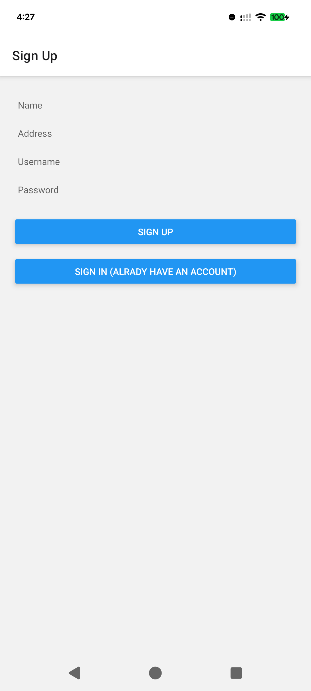
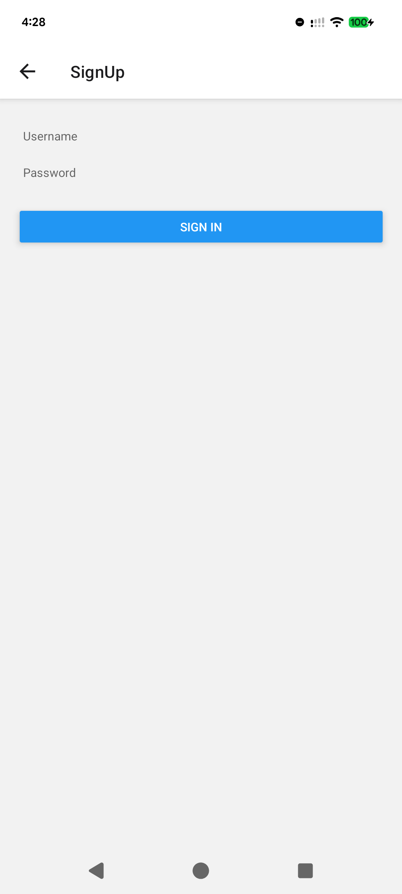
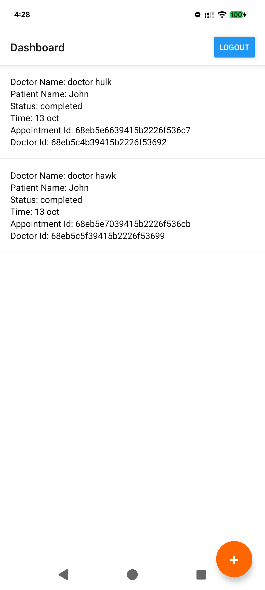
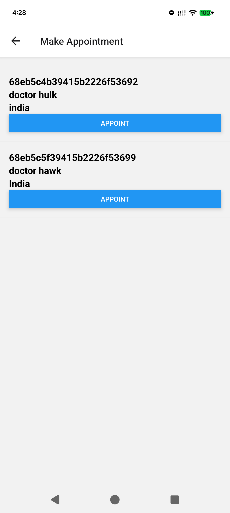
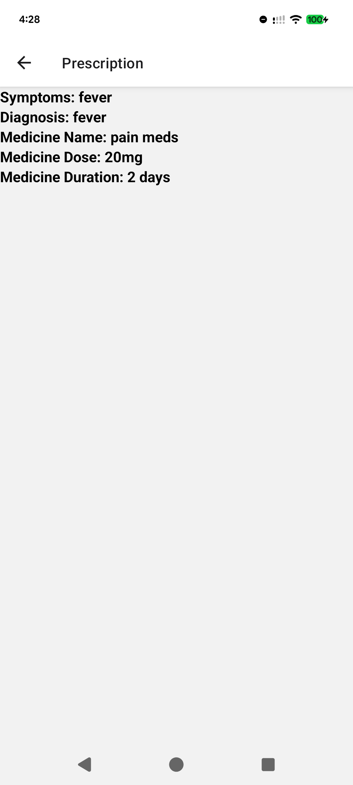
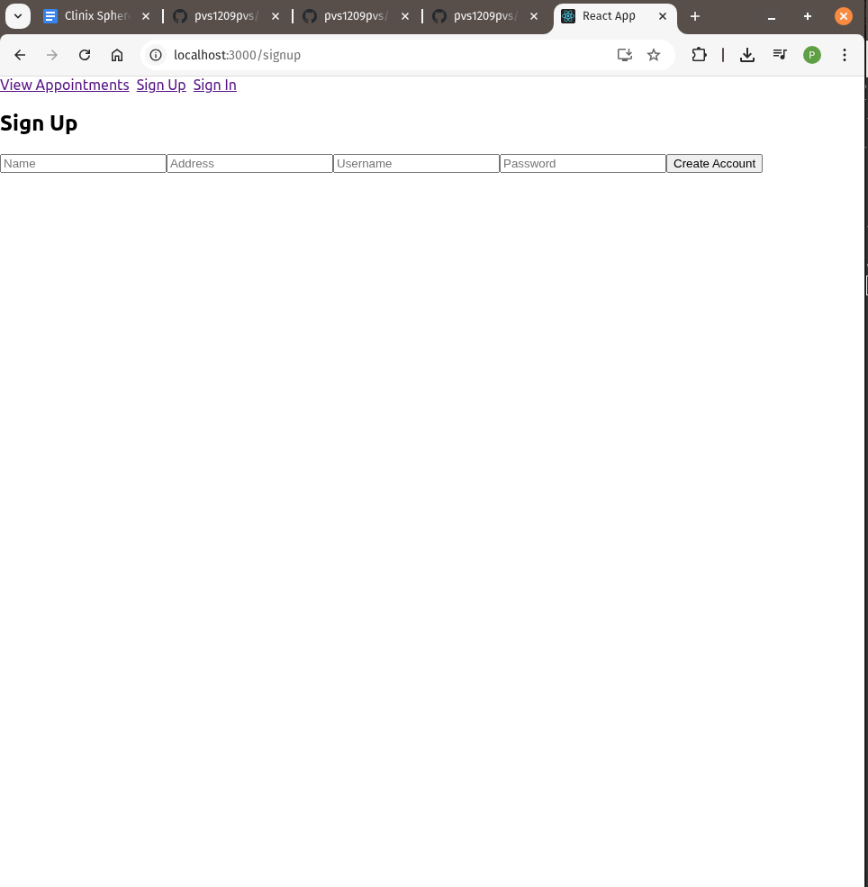
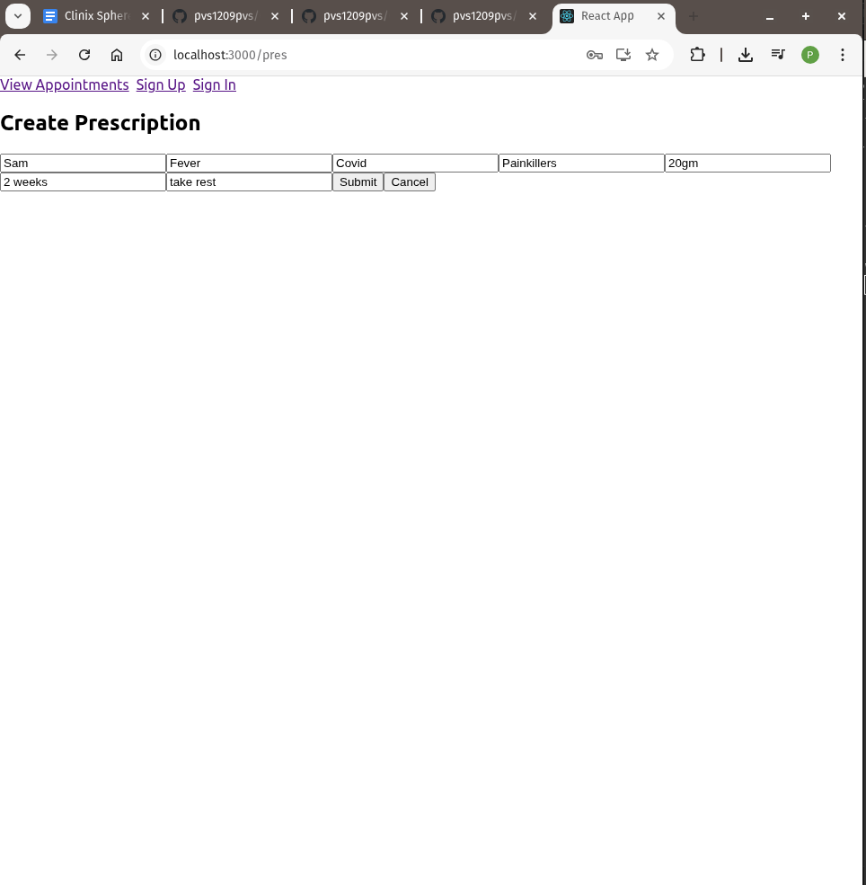
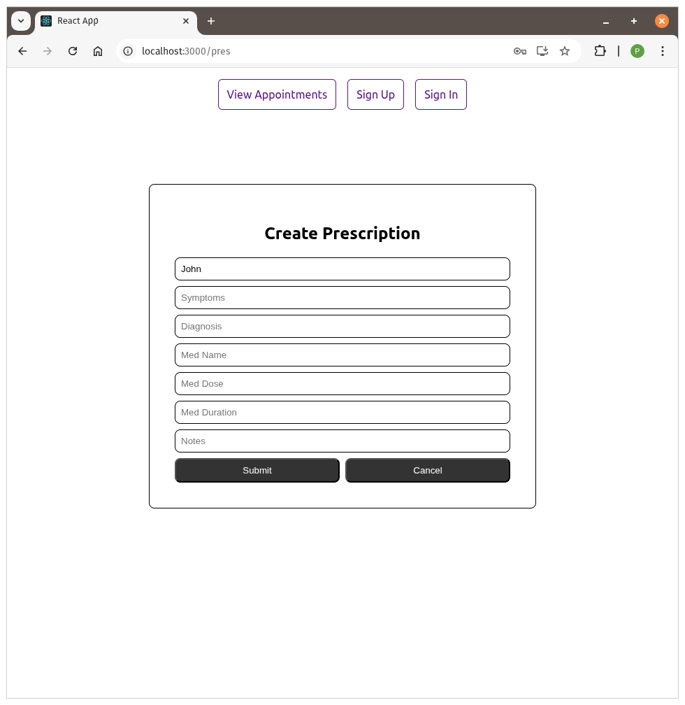

View demo at https://drive.google.com/drive/u/0/folders/17qaYgy2qzacETGfkvKOCWs6-yT9mSTow

Built using Expo.
Navigate to the root directory.  
Run `npm install` in your terminal to download the required npm packages.  
Run `npx expo start -c` to start the app.  

