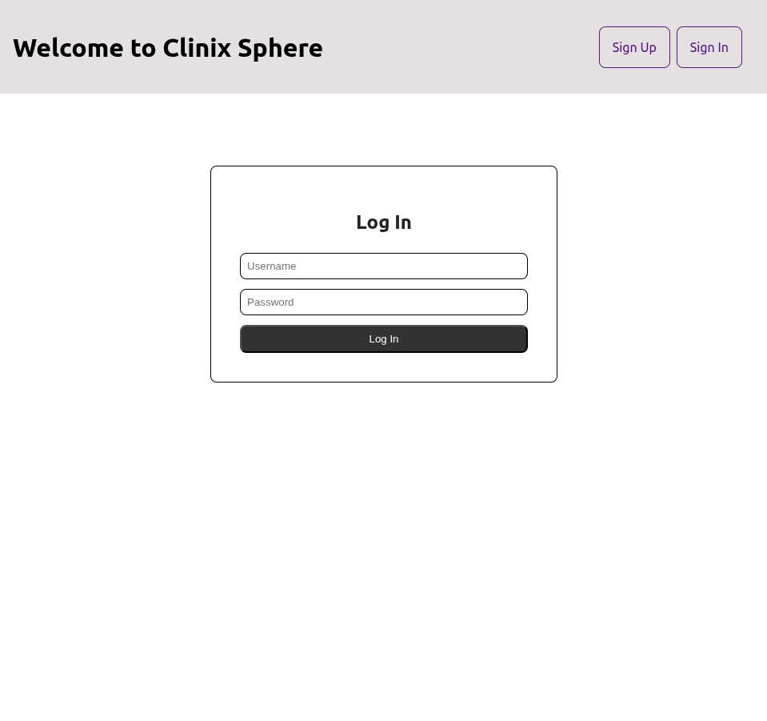
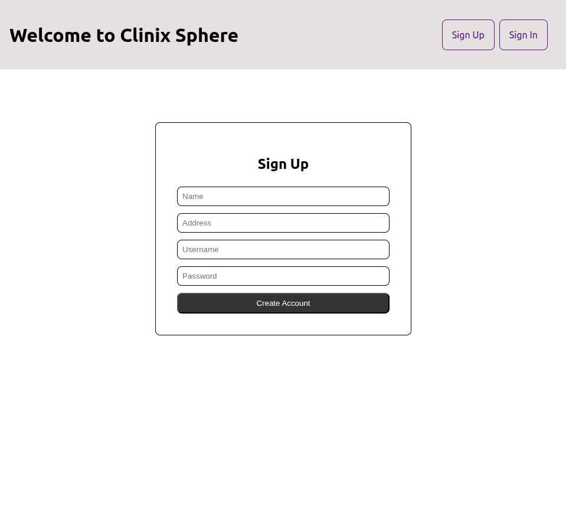
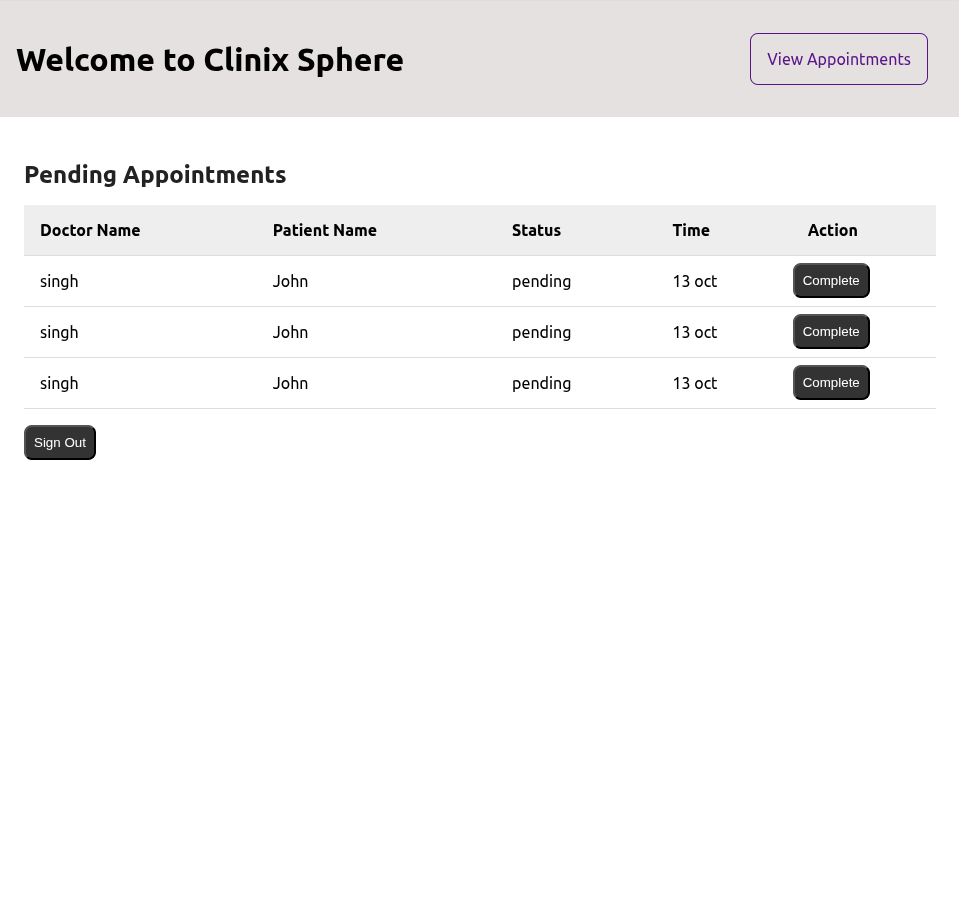
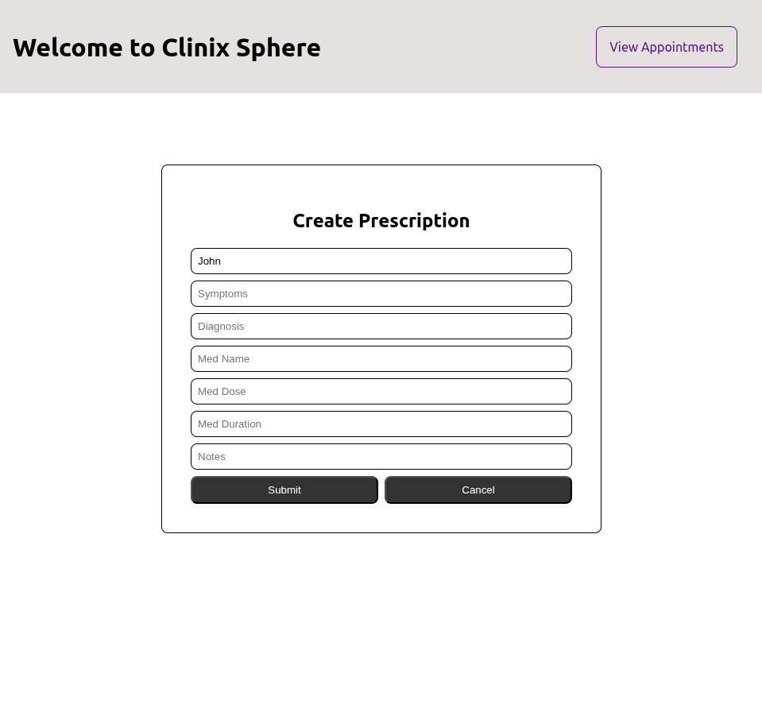
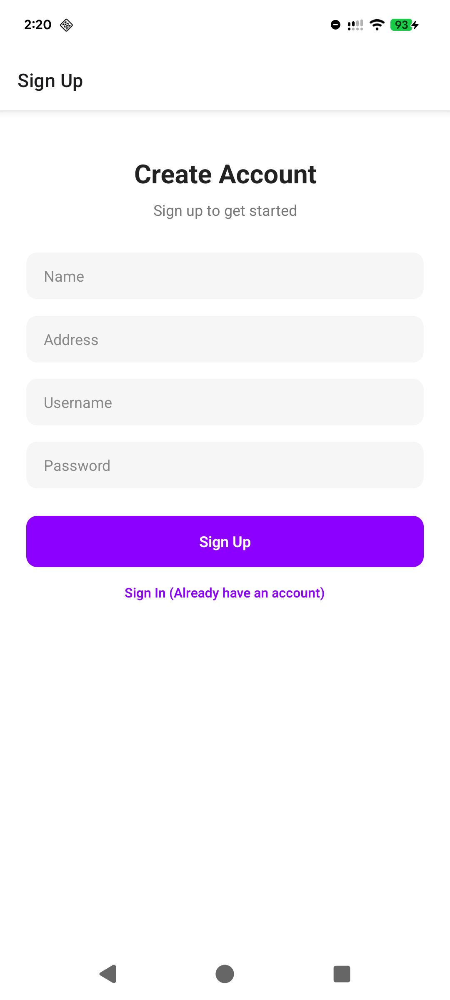
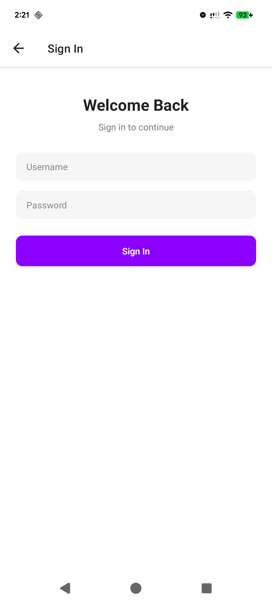
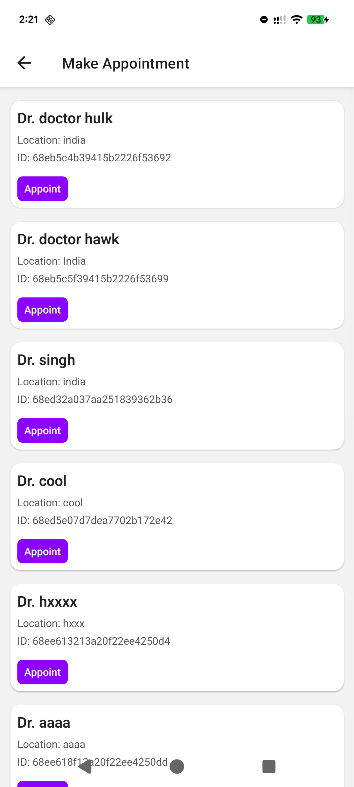
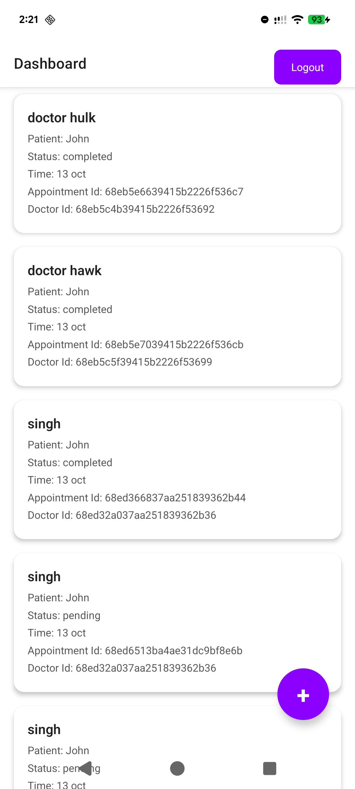
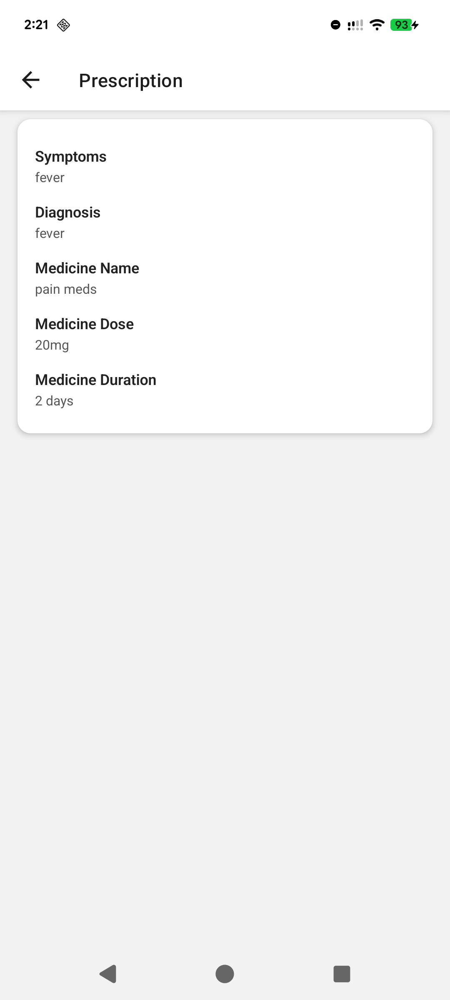

<h4>View Demo</h4>
https://drive.google.com/drive/u/0/folders/17qaYgy2qzacETGfkvKOCWs6-yT9mSTow

<h4>APK and AAB</h4>
https://drive.google.com/drive/folders/17-02mPl6JaLtuK8pPyV95tIUCuDyh3Dj?usp=drive_link 

<h4>Build Locally</h4>
Built using Expo.
Navigate to the root directory.  
Run `npm install` in your terminal to download the required npm packages.  
Run `npx expo start -c` to start the app.  

<h4>Sample Screenshots</h4>

